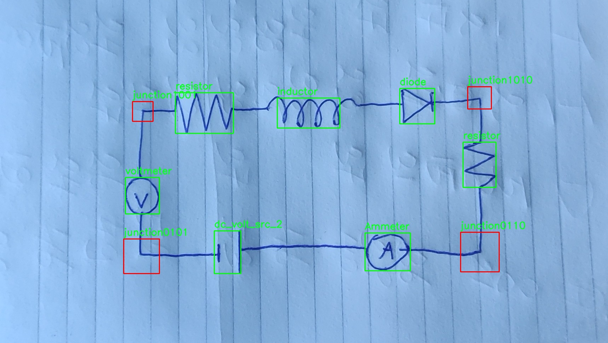

# Electronic Circuit Detection
As part of the course CS4245 Seminars Computer Vision by Deep Learning at the Delft University of Technology, we have developed a pipeline in order to convert sketches of electronic circuit into a labeled image. For a detailed overview of this project, please visit the [blogpost](https://timdnb.github.io/electronic-component-classification/).

## Installation
First create a virtual environment and install dependencies (tested for Python 3.10.12)
```
git clone git@github.com:Timdnb/electronic-component-classification.git
cd electronic-component-classification
python -m venv venv
source venv/bin/activate
pip install -r requirements.txt
```

## Usage
Take an image of your electronic circuit and store it, then run the following command

```
python detect.py --img-path <single-img | img-directory> [--outdir /path/to/outdir]
```
Arguments:
- `--img-path`: can be both a single image or a directory containing images
- `--outdir`: path where you want the output to be stored, defaults to the same directory as the input image(s)

After running a window will appear, in this window use the sliders to best extract the lines of your electronic circuit. Once you are satisfied press "Enter" to continue.

## Inference example
In the current state the pipeline classifies all components and junctions, however it does not yet convert it to a digital counterpart. This can be a future improvement.

Original:


Labeled:



## Additional information
The `notebooks/` folder contains all notebooks that were used during development, they can be investigated to have a better look into our methods. However one of the notebooks requires the presence of a hand-drawn electronic component dataset from [kaggle](https://www.kaggle.com/datasets/moodrammer/handdrawn-circuit-schematic-components). Download this dataset and put the folders of the separate components under a `dataset/components/` directory (make this directory yourself).